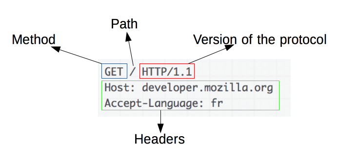

# HTTP HTTPS

HTTP(HyperText Transfer Protocol)는 클라이언트와 서버 간의 요청-응답 프로토콜로 통신한다.

가장 일반적인 두 가지 HTTP 메서드는 GET 과 POST이다.

HTTP는 `비연결성` 및 `무상태성 Stateless` 프로토콜이며 Method, Path, Version, Headers, Body 등으로 구성된다. HTTP는 요청 처리 후 연결을 끊어버리기 때문에, 클라이언트의 상태 정보 및 현재 통신 상태가 남아있지 않다.

- `비연결성` 의 장점 : 서버의 `자원 낭비를 줄일 수 있다`
- `비연결성` 의 단점: `클라이언트를 식별할 수 없다`

HTTP는 암호화가 되지 않은 평문 데이터를 전송하는 프로토콜이였기 때문에, HTTP로 비밀번호나 주민등록번호 등을 주고 받으면 제3자가 정보를 조회할 수 있었다. 이러한 문제를 해결하기 위해 등장한 것이 **HTTPS**이다.

**GET 메서드**

GET은 가장 일반적인 HTTP 메소드로, 지정된 리소스에서 데이터를 요청하는 데 사용된다.

- 쿼리 문자열(이름/값 쌍)은 GET 요청의 URL로 전송된다.
- GET 요청을 캐시할 수 있다.
- 브라우저 기록에 남는다.
- 북마크에 추가할 수 있다.
- 데이터 길이 제한이 있다.
- 데이터 요청에만 사용되며(수정 불가), 민감한 데이터를 처리할 때 GET 요청을 사용하지 않는다.

**POST 메서드**

post는 리소스를 생성/업데이트 하기 위해 서버에 데이터를 보내는 데 사용된다.

- POST를 통해 서버로 전송된 데이터는 HTTP 요청의 요청 본문에 저장된다.
- POST 요청은 캐시되지 않는다.
- 브라우저 기록에 남지 않는다.
- 북마크에 추가할 수 없다.
- 데이터 길이 제한이 없다.

### HTTPS란?

**HTTP에 데이터 암호화가 추가된 프로토콜**이다. HTTPS는 HTTP와 다르게 443번 포트를 사용하며, 네트워크 상에서 중간에 제3자가 정보를 볼 수 없도록 공개키 암호화를 지원하고 있다.

HTTPS는 공개키/개인키 암호화 방식을 이용해 데이터를 암호화하고 있다. 공개키와 개인키는 서로를 위한 1쌍의 키이다.

- 공개키: 모두에게 공개 가능한 키
  - 공개키 암호화: 공개키로 암호화를 하면 개인키로만 복호화할 수 있다. 개인키는 나만 가지고 있으므로, 나만 볼 수 있다.
- 개인키: 나만 가지고 알고 있어야 하는 키
  - 개인키 암호화: 개인키로 암호화하면 공개키로만 복호화할 수 있다. 공개키는 모두에게 공개되어 있으므로, 내가 인증한 정보임을 알려 신뢰성을 보장할 수 있다.

### **HTTP와 HTTPS**

HTTP는 암호화가 추가되지 않았기 때문에 보안에 취약한 반면, HTTPS는 안전하게 데이터를 주고받을 수 있다. 하지만 HTTPS를 이용하면 암호화/복호화의 과정이 필요하기 때문에 HTTP보다 속도가 느리다. (오늘날에는 거의 차이를 못 느낄 정도라고 한다.) 또한 HTTPS는 인증서를 발급하고 유지하기 위한 추가 비용이 발생한다.

개인 정보와 같은 민감한 데이터를 주고 받아야 한다면 HTTPS를 이용해야 하지만, 단순한 정보 조회 등만을 처리하고 있다면 HTTP를 이용하면 된다.
