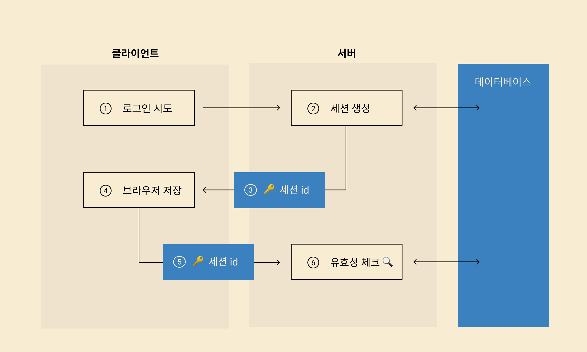

# Cookie & Session & Token

HTTP는 `비연결성` 및 `무상태성 Stateless` 프로토콜이며 Method, Path, Version, Headers, Body 등으로 구성된다. HTTP는 요청 처리 후 연결을 끊어버리기 때문에, 클라이언트의 상태 정보 및 현재 통신 상태가 남아있지 않다.

- `비연결성` 의 장점 : 서버의 `자원 낭비를 줄일 수 있다`
- `비연결성` 의 단점: `클라이언트를 식별할 수 없다`
  - ex) 로그인을 하더라도 다음 요청에서 해당 클라이언트를 기억 하지 못하거나, 새로고침을 누를 때마다 로그인을 해야한다.

이와 같은 문제점을 해결하기 위해 `Cookie` 와 `Session` 이라는 기술을 활용한다.

# 쿠키 (Cookie)

`쿠키(Cookie)` 란 클라이언트가 어떠한 웹사이트를 방문할 경우, 해당 사이트가 사용되고 있는 서버를 통해 `클라이언트의 브라우저에 설치되는 작은 기록 파일` 이다.

서버는 클라이언트의 `로그인 요청` 에 대한 `Response`를 작성할 때, 클라이언트에 저장하고 싶은 정보를 `Response Header` 의 `Set-Cookie` 에 담는다. (Key-Value 형식의 문자열) 이후 해당 클라이언트는 요청을 보낼 때마다 매번 저장된 `쿠키` 를 `Request Header` 의 `Cookie` 에 담아 보낸다.

서버는 `Cookie` 에 담긴 정보를 바탕으로 해당 요청의 클라이언트가 누군지 식별한다.

### 쿠키의 종류

- 만료 기간
  영구 쿠키(Persistent Cookie) : 만료 기간이 있다.
  세션 쿠키(Session Cookies) : 만료 기간이 없어 브라우저 종료시 삭제된다.
- 도메인
  First party Cookie : 같은 도메인 또는 서브 도메인에서 생성된 쿠키
  Third party Cookie : 다른 도메인에서 생성된 쿠키

SSR(Server Side Rendering)에서는 `Local Storage`의 값을 알 수 없기 때문에 쿠키를 활용하여 FrontEnd의 생산성을 높이기도 한다. 또한, 쿠키의 `HttpOnly` 옵션을 통해 Script를 이용한 `XSS` 공격을 방지할 수 있고, `Secure` 옵션을 통해 쿠키를 HTTPS로만 전송되게 만들어 보안 수준을 높일 수 있다.

### 쿠키의 단점

- 보안에 취약하다. (요청 시 쿠키의 값을 그대로 보내어, 유출 및 조작 당할 위험이 존재한다.)
- **용량 제한**이 있어, 많은 정보를 담을 수 없다.
- 웹 브라우저마다 쿠키에 대한 **지원 형태가 다르기에**, 브라우저 간 공유가 불가능하다.
- 쿠키의 사이즈가 커질수록 네트워크에 부하가 심해진다.

# 세션 (Session)

세션은 비밀번호 등 클라이언트의 인증 정보를 `쿠키` 가 아닌 `서버 측에 저장하고 관리` 한다.

서버는 클라이언트의 로그인 요청에 대한 응답을 작성할 때, 인증 정보는 서버에 저장하고, 클라이언트 식별자인 `JSESSIONID` 를 쿠키에 담는다. 이후 클라이언트는 요청을 보낼 때마다 `JSESSIONID` 쿠키를 함께 보내고, 서버는 `JSESSIONID` 의 유효성을 판별해 클라이언트를 식별한다.

### 인증(Authentication) & 인가(Authorization)

`인증(Authentication)`

1. 유저가 ID와 Password를 입력하여 서버에 `HTTP Request`를 보내면서 로그인을 시도한다.
2. 서버는 DB에서 유저를 확인하고, 성공 시 다음 스탭을 수행하고 실패 시 에러를 던져줄 것이다.
3. 유저가 확인되면, 서버는 세션을 생성하고 저장한다. (메모리, DB, Redis 등)
4. 여기서 얻어진 `JSESSIONID`를 쿠키에 담아 클라이언트에 반환한다. 클라이언트는 받은 `JSESSIONID` 를 쿠키에 저장한다.

`인가(Authorization)`

1. `마이페이지`와 같은 유저의 정보가 필요한 Request에 `JSESSIONID`가 저장된 쿠키를 함께 보낸다.
2. 서버에서 세션ID를 확인한다.
3. 로그인한 유저의 `마이페이지` 정보를 찾는다.
4. 클라이언트가 요청한 정보를 Response한다.



### 세션 기반 인증의 장점

- 서버가 클라이언트의 웹 브라우저에 의존하지 않아도 된다.
- 쿠키를 포함한 요청이 외부에 노출되어도 세션 ID 자체는 `유의미한 개인 정보를 담지 않는다`.
- 각 사용자마다 고유한 세션 ID가 발급 되기 때문에, 요청이 들어올 때마다 `회원 정보를 확인(로그인)할 필요 없다.`

### 세션 기반 인증의 단점

- 해커가 세션 ID를 중간에 탈취하여 `클라이언트인 척 위장`할 수 있다.
- `서버에서 세션 저장소를 사용`하기 때문에, 요청이 많아지면 서버에 부하가 생긴다.

# 토큰 (Token)

토큰 기반 인증 `JWT(JSON Web Token)` 는 인증에 필요한 정보들을 암호화 시킨 토큰이다.

`JWT 기반 인증` 은 쿠키/세션 방식과 유사하게 `JWT 토큰(Access Token)`을 `HTTP Header`에 실어 서버가 클라이언트를 식별한다.


JWT의 구조는 위 사진과 같이 세가지 문자열의 조합이다. 실제 디코딩된 JWT는 `Header`, `Payload`, `Signature`로 이루어져 있다.

### Header

`Header`는 `alg`와 `typ`을 갖고 있다.

`alg`는 정보를 암호화할 해싱 알고리즘을, `typ`는 토큰의 타입을 지정한다.

```json
{
  "alg": "HS256",
  "typ": "JWT"
}
```

### Payload

`Payload`는 실제로 토큰에 담을 정보를 지니고 있다.

주로 `클라이언트 고유 ID`, `유효 기간` 등이 포함된다.

`Key-Value` 형식으로 이루어진 한 쌍의 정보를 `Claim`이라고 한다.

```json
{
  "sub": "1234567890",
  "name": "John Doe",
  "iat": 1516230922
}
```

### Signature

`Signature`는 인코딩된 `Header`와 `Payload`를 더한 뒤, 비밀키로 해싱하여 생성한다.

`Header` 및 `Payload`는 단순 인코딩된 값이기 때문에 해커가 복호화하고 조작할 수 있지만, `Signature`는 서버 측에서 관리하는 비밀키가 유출되지 않는 이상 복호화할 수 없다.

따라서 `Signature`는 토큰의 **위변조 여부를 확인**하는 데 사용된다.

```java
HMACSHA256(
	base64UrlEncode(header) + "." +
	base64UrlEncode(payload),
	secret_key
)
```

### 토큰 인증 과정

1. 클라이언트 로그인 요청이 들어오면, 서버는 검증 후 클라이언트 고유 ID등의 정보를 `Payload`에 담는다.
2. 암호화할 비밀 키를 사용해 `Access Token(JWT)`을 발급한다.
3. 클라이언트는 전달 받은 토큰을 저장해두고, 서버에 요청할 때마다 토큰을 요청 헤더 `Authorization`에 포함 시켜 함께 전달한다.
4. 서버는 토큰의 `Signature` 을 비밀 키로 복호화한 다음, `위변조 여부` 및 `유효 기간` 등을 확인한다.
5. 유효한 토큰이라면 요청에 응답한다.

### 토큰의 장점

- `Header`와 `Payload`를 가지고 `Signature`를 생성하므로 데이터 위변조를 막을 수 있다.
- 인증 정보에 대한 **별도의 저장소가 필요 없다**. (I/O 처리 필요 없음)
- `토큰에 대한 기본 정보`와 `전달할 정보` 및 `토큰이 검증됐음을 증명하는 서명` 등 필요한 모든 정보를 자체적으로 지니고 있다.
- 클라이언트의 인증 정보를 저장하는 세션과 다르게, 서버는 `무상태(Stateless)`가 된다.
- 확장성이 우수하다.
- 토큰 기반으로 다른 로그인 시스템에 `접근` 및 `권한 공유`가 가능하다.
- `OAuth`의 경우 Facebook, Google 등 소셜 계정을 이용해 다른 웹 서비스에서도 로그인 할 수 있다.
- 모바일 어플리케이션 환경에서도 잘 동작한다.

### 토큰의 단점

- `쿠키`, `세션`과 다르게 JWT는 토큰의 길이가 길어, 인증 요청이 많을수록 네트워크 부하가 심해진다.
- `Payload` 자체는 암호화되지 않기 때문에 유저의 중요한 정보는 담을 수 없다. (패스워드 등)
- 토큰을 탈취 당하면 대처하기 어렵다. 토큰은 한 번 발급 되면 유효 기간이 만료될 때까지 계속 사용이 가능하다.
- 특정 사용자의 접속을 강제로 만료 하기 어렵다. (쿠키/세션 기반 인증은 서버 단에서 쉽게 삭제 가능하다.)

### 토큰의 단점을 보완하기 위한 전략

### 짧은 만료 기한 설정

토큰의 만료 기한을 짧게 설정해서 탈취 되더라도 빠르게 만료 시키는 방법이다.

하지만 이는 토큰이 만료되면 사용자가 다시 로그인해야 한다는 뜻이기에 사용자 입장에서 번거로운 방법이다.

### Sliding Session

서비스를 지속적으로 이용하는 클라이언트에게 **자동으로 토큰 만료 기한을 늘려주는 방법**이다

만약 글을 작성하다가 토큰이 만료된다면 새로운 토큰을 발급해주는 것이다.

사용자가 로그인을 자주 할 필요가 없다.

### Refresh Token

클라이언트가 로그인할 때 `Access Token` 및 `Refresh Token`을 발급해주는 방법이다.

`Refresh Token`은 `Access Token`보다 만료 기한이 긴 토큰이다. (`Access Token` 이 만료되면 로그인이 만료되어 다시 로그인 해야 한다.)

클라이언트가 요청을 보냈는데 `Access Token`이 만료되었을 때, `Refresh Token`을 이용하여 `Access Token`의 재발급을 요청한다.

이때 서버는 DB에 저장된 `Refresh Token`과 비교하여 유효하면 `Access Token`을 발급한다.

만약 `Refresh Token`도 만료된 경우라면 사용자에게 로그인을 요구한다.

### 💡**Refresh Token이 탈취 당하는 경우**

- 데이터베이스에 각 사용자에 1대1로 맵핑되는 Access Token, Refresh Token 쌍을 저장한다.
- 정상적인 사용자는 기존의 Access Token으로 접근하며 서버측에서는 데이터베이스에 저장된 Access Token과 비교하여 검증한다.
- 공격자는 탈취한 Refresh Token으로 새로 Access Token을 생성한다. 그리고 서버측에 전송하면 서버는 데이터베이스에 저장된 Access Token과 공격자에게 받은 Access Token이 다른 것을 확인한다.
- 만약 데이터베이스에 저장된 토큰이 아직 만료되지 않은 경우, 즉 굳이 Access Token을 새로 생성할 이유가 없는 경우 서버는 Refresh Token이 탈취당했다고 가정하고 두 토큰을 모두 만료시킨다.
- 이 경우 정상적인 사용자는 자신의 토큰도 만료됐으니 다시 로그인해야 한다. 하지만 공격자의 토큰 역시 만료됐기 때문에 공격자는 정상적인 사용자의 리소스에 접근할 수 없다.
