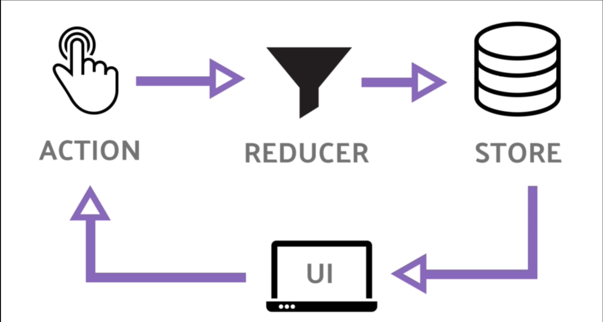
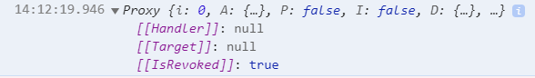

# Redux / Redux Toolkit

**Reducer + Flux :** 기존의 Flux 패턴을 기반으로 한 상태 관리 라이브러리.




사용자의 Action이 발생하면 => Reducer가 Action 맞는 데이터를 가공하고 => Store는 가공된 데이터의 상태를 저장하고 => View에 반영.

- Store 는 data를 저장하는 곳이다.
- **CreateStore**는 Reducer를 요구한다.
- **Reducer**는 값을 최신 화 해주는 함수로 Store에서 현재 state값을 가져와 새로운 state를 반환해준다.
- **Action**은 `type`과 `payload` 프로퍼티를 가지며 `type`은 어떤 액션 인지를 나타내며, `payload`는 데이터를 담고 있고, Dispatch를 통해 reducer 함수로 보내진다.
- **Dispatch** 안에 사용할 action을 Reducer로 전달하면 이전 state에서 변경된 state를 확인하여
  **새로운 state**를 반환(업데이트)해준다.

# Redux-Toolkit

Redux-toolkit의 공식 문서에 의하면 redux-toolkit이 만들어진 이유는 크게 세가지 이다.

1. `redux` 스토어 구성의 복잡성
2. `redux` 를 사용할 때 많은 패키지 추가의 필요성
3. `redux` 사용 시 많은 상용 코드 필요

**cmsFeature.js**

createSlice를 사용하여 createAction의 사용 없이 자동으로 action 타입을 정의해준다.

```jsx
import { createSlice } from "@reduxjs/toolkit";
import { getPushAlert } from "../api/cmsInfo";
import initialState from "./initialState";

export const cmsSlice = createSlice({
  name: "cms",
  initialState,
  reducers: {},
  extraReducers: (builder) => {
    builder.addCase(getPushAlert.pending, () => {});
    builder.addCase(getPushAlert.fulfilled, (state, action) => {
      state.pushAlert = action.payload;
    });
    builder.addCase(getPushAlert.rejected, (state, action) => {
      state.error = [...state.error, action.payload];
    });
  },
});

export default cmsSlice.reducer;
```

**redux**는 **react**와 마찬가지로 **reference 값 비교(얕은 비교)**를 통해 상태를 확인한다. 그래서 `redux`에서는 상태를 직접 변경해서는 안된다.

만약 상태를 직접 변경하게 되면 아래와 같은 문제점들을 야기한다.

- UI가 최신값으로 제대로 업데이트 되지 않는다
- 상태가 업데이트 된 이유와 방법을 이해하기 어렵다.
- 테스트 작성이 어렵다.
- 시간 디버깅을 올바르게 사용하는 기능이 중단된다.

**Redux-Toolkit**의 createReducer API는 자동으로  `immer`(불변성을 유지하는 코드를 작성하기 쉽게 해주는 라이브러리)를 사용하고, createSlice 내의 reducers 내부에서 createReducer를 사용한다.

**extraReducers** 는 createAsyncThunk를 사용해 정의된 액션 함수나 다른 Slice에서 정의된 액션 함수와 같은 외부의 액션을 참조하기 위해 사용한다.

**cmsInfo.js**

Redux Toolkit에는 내부적으로 thunk를 내장하고 있어서, 다른 미들웨어를 사용하지 않고도 비동기 처리를 할 수 있다.

```jsx
import { Api } from "@libs/Http";
import { createAsyncThunk } from "@reduxjs/toolkit";
import axios from "axios";

export const getDiagFront = createAsyncThunk('cms/getDiagFront', () => {
  const baseUri = Api.getThinqCare();
  const url = `${baseUri}/caresds/api/v1.0/diag/front`;
  return axios
    .get(url,{
      headers: headers()
    })
    .then((res) => res.data.result)
    .catch((err) => thunkAPI.rejectWithValue(err));
  }
```

**index.js (network)**

위에서 만든 thunk와 slice를 **dispatch를 통해 스토어 상태를 변경 시키기 위해 액션을 호출**한다.

```jsx
const initCareApi = async () => {
      await store.dispatch(getOriginDevices());
      store.dispatch(getPushAlert());
      store.dispatch(getDiagFront());
    };
    initCareApi();
  }
```

**careInfoReportHeader.js**

**UseSelector**는 store에 저장된 state 값을 반환하여 적절한 컴포넌트에서 사용하여 불필요한 렌더링을 최소화 할 수 있다. (reducer의 메모리 주소 값이 변경 되는 것을 감지.)

**state => state.모듈명  형식으로 상태값을 반환**할 수 있다.

```jsx
const pushAlert = useSelector((state) => state.cmsStore.pushAlert);
const diag = useSelector((state) => state.cmsStore.diag.summary);
```

# **Immer 의** \***\*draft\*\***

리덕스에서 새로운 state를 반환하기 위한 함수로 reducer를 사용하며 이 때 불변성을 지켜줘야 한다. 불변성을 지키기 위해서는 **이전 상태를 변경하지 않고, 이전 상태를 참조해 새로운 상태를 반환**해 줘야 하며, 이때 **얕은 복사**를 이용한다.
얕은 복사를 이용해서 충분히 불변성을 유지할 수 있지만, depth가 깉어질수록 코드가 길어지고 가독성이 떨어지는 문제가 발생한다.
이를 해결하기 위해 등장한 것이 **Immer**이다.

```jsx
const initialState = {
  data: null,
  isLogin: false,
};

const userReducer = (prevState = initialState, action) => {
  return produce(prevState, (draft) => {
    switch (action.type) {
      case "SUCCESS":
        draft.data = action.data;
        draft.isLogin = true;
        break;
      case "FAILURE":
        draft.data = null;
        draft.isLogin = false;
        break;
      default:
        break;
    }
  });
};

module.exports = userReducer;
```

- immer를 사용하기 위해서는 produce(prevState, callback) 함수로 감싸주어야 한다.
- callback함수의 인자로는 draft를 넣어준다.
- draft는 prevState를 **얕은 복사한 값**이라고 생각하면 된다.
- draft값을 변경해 불변성을 유지한채 nextState를 만들 수 있다.

리듀서에서 진행 중인 상태를 로깅하기 위해 console.log(state)를 찍어보면 브라우저는 읽거나 이해하기 어려운 형식으로 프록시 인스턴스를 표시한다.



이 문제를 해결하기 위해 Immer에는 래핑된 데이터의 복사본을 추출하는 current 함수를 포함하고 있다. Redux Toolkit에서는 이를 통해 리듀서의 진행 상태를 디버깅 할 수 있다.

```jsx
import { current } from "@reduxjs/toolkit";

const slice = createSlice({
  name: "",
  initialState: todosAdapter.getInitialState(),
  reducers: {
    todoToggled(state, action) {
      // ❌ ERROR: logs the Proxy-wrapped data
      console.log(state);
      // ✅ CORRECT: logs a plain JS copy of the current data
      console.log(current(state));
    },
  },
});
```

📚 **참고자료**

---

[Web: React Flux 패턴](https://medium.com/hcleedev/web-react-flux-%ED%8C%A8%ED%84%B4-88d6caa13b5b)

[React의 상태 관리 (Redux vs React Query + Recoil)](https://velog.io/@sunohvoiin/React의-상태-관리-Redux-vs-React-Query-Recoil)

[[React Native] Redux란? (feat. Flux)](https://fomaios.tistory.com/entry/React-Native-Redux란)

[Redux + Redux-thunk 동작원리](https://velog.io/@y1andyu/Redux-Redux-thunk-동작원리)

redux toolkit

[Toolkit과 Immer에 대해서](https://velog.io/@moduri/Toolkit과-Immer에-대해서)

[Redux Toolkit의 createAsyncThunk로 비동기 처리하기](https://velog.io/@raejoonee/createAsyncThunk)

[Redux-toolkit과 Redux의 차이점](https://velog.io/@inwoong100/Redux-toolkit과-Redux의-차이점)

[Redux Toolkit : Immer와 함께 사용하기](https://itchallenger.tistory.com/706)
