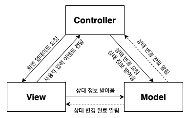

# REACT

웹/앱 어플리케이션에서 독립적이고 재사용이 가능한 컴포넌트들로 이루어진, Web UI(User Interface)를 만드는 라이브러리.

## 중요 컨셉

### 1. MVC 디자인 패턴

Model View Controller 중 **View**를 담당하여, 사용자에게 UI를 보여주고 이벤트를 처리함.

### 2. State 와 Props

- state: 컴포넌트 UI를 위한 데이터를 보관하는 오브젝트, 데이터에 업데이트가 발생하면 리액트가 자동적으로 render함수를 호출함.
- props: 컴포넌트 밖에서 주어지는 데이터(컴포넌트의 재사용을 높이기 위함.) 데이터에 맞게 UI를 보여주기 위함.

### 3. Virtual DOM

1. 리엑트의 가상 DOM은 실제 DOM과 같은 내용을 담고 있는 복사본이다.
   이 복사본은 **자바스크립트 객체 형태로 메모리상에 저장**되어 있다.
2. 리액트는 항상 **두 개의 가상 DOM**을 갖고 있다. 첫 번 째 가상돔은 변경 이전의 내용을, 두 번 째는 변경 이후에 보여질 내용을 담고 있다.
3. 변경된 내용이 화면에 새롭게 그려지기 이전, 즉 실제 DOM이 변경되기 전에 리액트는 **두 개 의 가상돔을 비교해서 정확히 어떤 부분이 바뀌었는지** 효율적으로 파악한다.
   이러한 과정을 **Diffing**이라고 부른다.
4. Diffing을 통해서 변경된 부분들을 파악한 이후, 리액트는 **Batch Upadate**를 수행하여 **실제 DOM에 한번에 적용**시킨다. 이러한 과정을 **Reconsilation, 재조정** 이라고 한다.

### 4. 클래스 Vs 함수형 컴포넌트

클래스 특성상, 클래스의 인스턴스(오브젝트)가 생성되면 클래스의 메소드(함수)를 아무리 많이 호출해도 클래스의 멤버 변수를 직접적으로 수정하지 않는한, 멤버 변수는 계속 값을 유지한다.  
그러므로, `render 함수`가 아무리 많이 호출 되어져도 `this.state에` 들어있는 데이터는 변하지 않기 때문에, 컴포넌트에서 가지고 있던 데이터를 잃어버리지 않고 일정하게 데이터를 사용자에게 보여줄수 있다.  
만약, 컴포넌트에서 데이터를 변경해서 UI를 업데이트 하려면, 간단하게 this.state만 업데이트 해주어, 리액트가 알아서 render 함수를 다시 호출해 주고 브라우저에 업데이트하게 하면 된다.

리액트에서 컴포넌트를 만들려면 React.Component 클래스를 상속한다. 데이터는 꼭 `this.state`에 담아두고, `render()` 함수에 JSX 문법을 이용해서 데이터를 어떻게 UI로 표기할건지 정의를 해놓도록 만드는 것이 리액트 라이브러리에서 정해진 규칙이다.  
`데이터(State)`가 변경되면, 리액트가 `render()` 함수를 호출해서 UI가 업데이트 된다.

**리액트 훅 (React Hooks)**

리액트 훅은 클래스 컴포넌트에서만 이용 가능했던 State와 라이프 싸이클 메소드들을 함수형 컴포넌트에서 이용할 수 있도록 도와주는 기능이다. 리액트에서 기본적으로 제공되는 use로 시작하는 함수들과, 직접 정의해서 만드는 Custom Hooks가 있다.
