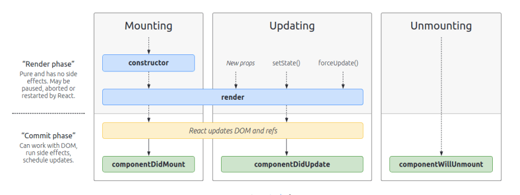
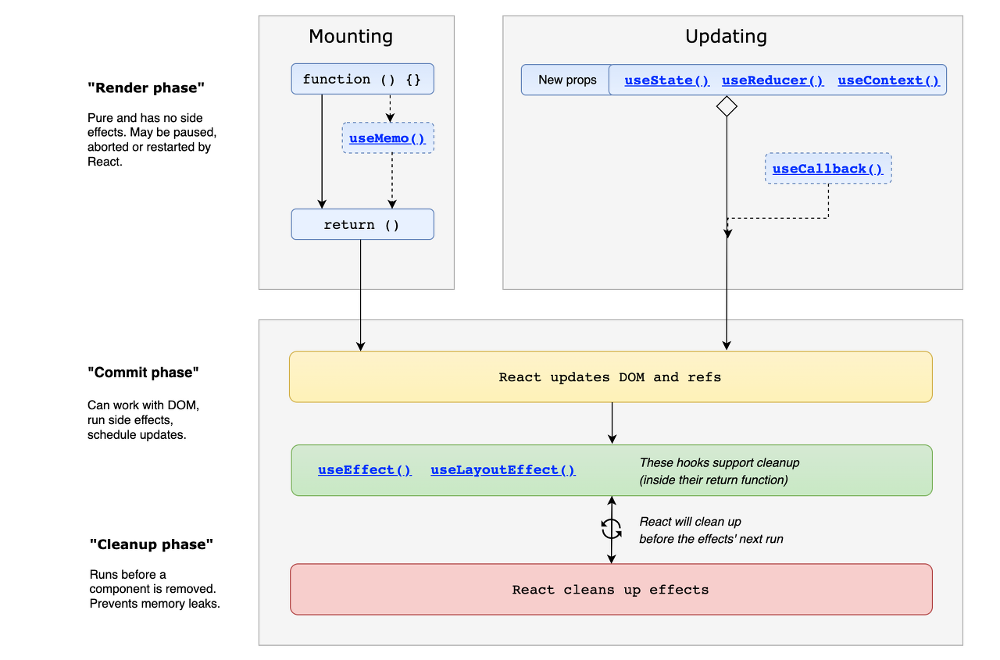

# Life Cycle(생명 주기)

컴포넌트의 수명은 페이지에 렌더링되기 전인 준비 과정에서 시작하여 페이지에서 사라질 때 끝난다. 컴포넌트는 `생성(mounting) -> 업데이트(updating) -> 제거(unmounting)` 의 생명 주기를 가진다.

리액트 클래스 컴포넌트는 `라이프 사이클 메서드`를 사용하고, 함수형 컴포넌트는 `Hook`을 사용한다.

# Class Component 생명 주기



## **마운트(Mount)**

DOM이 생성되고 웹 브라우저상에 나타나는 것을 `Mount` 라고한다.

- **Constructor**
  - 컴포넌트 생성자 메서드, 컴포넌트가 생성되면 가장 먼저 실행되는 메서드.
  - `this.props`, `this.state`에 접근이 가능하고 리액트 요소를 반환한다.
- **getDerivedStateFromProps**
  - props로부터 파생된 state를 가져온다. 즉 props로 받아온 것을 state에 넣어주고 싶을 때 사용한다.
- **render**
  - 컴포넌트를 렌더링하는 메서드.
- **componentDidMount**
  - 컴포넌트가 마운트 됨, 즉 컴포넌트의 첫번째 렌더링이 완료되면 호출되는 메서드.
  - 이 메서드가 호출되는 시점에는 화면에 컴포넌트가 나타난 상태이다.
  - 주로 DOM을 사용해야 하는 외부 라이브러리 연동, 해당 컴포넌트에서 필요로 하는 데이터를 ajax로 요청 등의 행위를 한다.

## **업데이트(Updating)**

- **getDerivedStateFromProps**
  - 컴포넌트의 props나 state가 바뀌었을 때도 이 메서드가 호출된다.
- **shouldComponentUpdate**
  - 컴포넌트가 리렌더링 할지 말지 결정하는 메서드.
  - `React.memo`와 유사함, boolean 반환으로 결정
- **componentDidUpdate**
  - 컴포넌트가 업데이트 되고 난 후 발생.
  - 의존성 배열이 변할 때만 `useEffect`가 실행되는 것과 같음.

## **언마운트(Unmount)**

언마운트라는 것은 컴포넌트가 화면에서 사라지는 것을 의미

- **componentWillUnmount**
  - 컴포넌트가 화면에서 사라지기 직전에 호출된다.
  - 주로 DOM에 직접 등록했었던 이벤트를 제거한다. (`setTimeOut` → `clearTimeOut`)
  - 외부 라이브러리를 사용했거나, 해당 라이브러리에 dispose기능이 있다면 여기서 호출하면 된다.

# **Functional Componet 생명주기**

리액트에서 `Hook`은 함수형 컴포넌트에서 Reac의 `state`와 `생명 주기` 기능을 연동 할 수 있게 해주는 함수이다.



## useEffect

화면에 렌더링이 완료된 후에 수행되며`componentDidMount` , `componentDidUpdate`, `componentWillUnmount`가 합쳐진 것. 만약 화면을 다 그리기 이전에 동기화 되어야 하는 경우에는,**`useLayoutEffect`**를 활용하여 **컴포넌트 렌더링 - useLayoutEffect 실행 - 화면 업데이트** 순으로 effect를 실행시킬 수 있다.

```jsx
useEffect(() => {}); // 렌더링 결과가 실제 돔에 반영된 후마다 호출
useEffect(() => {}, []); // 컴포넌트가 처음 나타날때 한 번 호출
useEffect(() => {}, [의존성1, 의존성2, ..]); // 조건부 effect 발생, 의존성 중 하나가 변경된다면 effect는 항상 재생성.
```

## useContext

Context API를 통해 만들어진 Context에서 제공하는 Value를 가져올 수 있다

```jsx
const value = useContext(MyContext);
```

컴포넌트에서 가장 가까운 `<MyContext.Provider>`가 갱신되면 이 Hook은 그 `MyContext` provider에게 전달된 가장 최신의 context `value`를 사용하여 렌더러를 트리거 한다.

## useReducer

`useState`의 대체 함수로 컴포넌트 상태 업데이트 로직을 컴포넌트에서 분리 시킬 수 있다.

컴포넌트 바깥에 로직을 작성할 수 도 있고, 심지어 다른 파일에 작성한 후 불러와서 사용할 수도 있다. `reducer` 란 현재 상태와 액션 객체를 파라미터로 받아와서 새로운 상태를 반환해주는 함수이다.

```jsx
const [state, dispatch] = useReducer(reducer, initialArg, init);
```

## useRef

특정 DOM을 선택 할 때 주로 쓰이며, `.current` 프로퍼티로 전달된 인자로, 초기화된 변경 가능한 ref 객체를 반환한다. 반환 된 객체는 컴포넌트의 전 생애 주기를 통해 유지된다.

```jsx
const TestRef = useRef(null);
```
