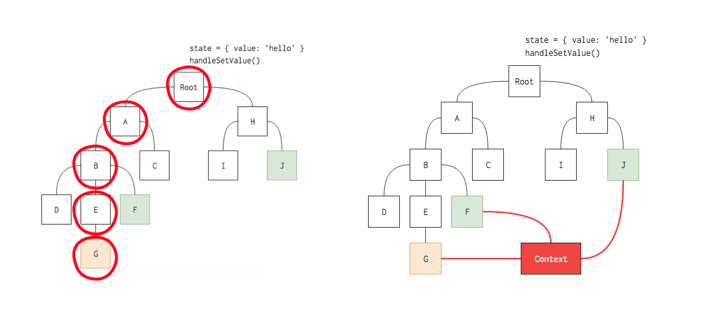

# Context API

컴포넌트 간, 전역적(global)인 데이터를 공유할 수 있도록 고안된 방법. 리액트는 16.3 버전부터 정식적으로 Context API를 지원하고 있다.

### Context API?

리액트에서 일반적인 컴포넌트는 Props를 통해 데이터를 전달한다. 하지만 여러 컴포넌트들에게 전달할 props가 존재할 경우 이 과정은 매우 번거로워지며, 애플리케이션의 유지보수에 좋지 않다.

위의 문제점을 해결하기 위해 **redux**와 **Mobx** 같은 라이브러리를 사용하여 데이터 상태 관리를 해주거나, 리액트 자체에서 제공하는 **Context API**를 사용하여 글로벌한 상태 관리를 할 수 있다.

**Context api**는 따로 다양한 개념에 대해 공부해야 하는 라이브러리에 비해 **Provider / Consumer / createContext** 개념만 알면 적용이 가능하다.



### Context API 의 3가지 주요 개념

- **React.createContext(defaultValue)**
  - context 객체를 만들 때 사용하는 함수.
  - createContext 함수를 호출하면 Provider와 Consumer 컴포넌트를 반환한다.
  - defaultValue는 Provider를 사용하지 않을 때 적용될 초기값이다.
- **Context.Provider**
  - 정의한 context를 하위 컴포넌트에게 전달하는 역할을 한다.
  - context의 value를 변경하는 역할을 한다.
  - Provider를 사용할 때에는 value를 꼭 명시해주어야만 동작한다.
  - 전달 받는 컴포넌트의 수는 제한이 없다.
  - Provider에 하위 Provider 배치가 가능하며, 이 경우 하위 Provider 값이 우선 시 된다.
  - Provider 하위에 context를 가진 컴포넌트는 provider의 value로 가진 state가 변화할 때마다, 전부 re-render 된다.
- **Context.Consumer**
  - context 변화를 구독하는 컴포넌트를 말한다.
  - 설정한 값을 불러와야 할 때 사용한다.
  - context의 자식은 함수(컴포넌트)여야 한다.
  - 이 함수(컴포넌트)가 가지는 context 값은 가장 가까운 Provider의 값이다.
  - 상위 Provider가 없다면 createContext에서 정의한 defaultValue 값을 가진다.

### Context API 예시

- 다크모드
  **DarkModeContext.jsx**

  ```jsx
  import React, { createContext } from "react";

  export const DarkModeContext = createContext(); // context 객체 생성

  export function DarkModeProvider({ children }) {
    const [darkMode, setDarkMode] = useState(false);
    const toggleDarkMode = () => setDarkMode((mode) => !mode);
    return (
      <DarkModeContext.Provider value={{ darkMode, toggleDarkMode }}>
        // 사용하고자 하는 속성 Provider의 value로 공급
        {children}
      </DarkModeContext.Provider>
    );
  }
  ```

  **AppTheme.jsx**

  ```jsx
  import React, { createContext } from "react";
  import { DarkModeProvider } from "./context/DarkModeContext";

  export default function AppTheme() {
    return (
      <DarkModeProvider>
        {" "}
        // provider로 감싸주기
        <Header />
        <Main />
        <Footer />
      </DarkModeProvider>
    );

    function ProductDetail() {
      const { darkMode, toggleDarkMode } = useContext(DarkModeContext);
      return <button onClick={() => toggleDarkMode()}>Toggle</button>;
    }
  }
  ```

**users.js**

```jsx
import React, { createContext } from "react";

export const UserContext = createContext(); // UserContext 라는 context 객체를 생성한다.

const UserStore = (props) => {
  const users = {
    name: "jun",
    job: "developer",
  };
  return (
    <UserContext.Provider value={users}>{props.children}</UserContext.Provider>
  ); // provider를 통해 하위 컴포넌트를 렌더링 하고, value로 지정한 users 데이터를 넘겨 준다.
};

export default UserStore;
```

**App.js**

```jsx
import React from "react";
import { BrowserRouter as Router, Route, Routes } from "react-router-dom";
import About from "./pages/about";
import Profile from "./pages/profile";
import UserStore from "./store/users";

export default function App() {
  return (
    <UserStore>
      {" "}
      // users.js에서 생성한 UserStore context로 감싸 줘야만 하위 컴포넌트에 접근
      가능.
      <Router>
        <Routes>
          <Route path="/page1/*" element={<About />} />
          <Route path="/page1/*" element={<Profile />} />
        </Routes>
      </Router>
    </UserStore>
  );
}
```

**about.js**

```jsx
import React, { useContext } from "react";
import { UserContext } from "../store/users";

const About = (props) => {
  // props로 데이터를 따로 전달 받지 않아도 됨.
  const context = useContext(UserContext); // useContext로 UserContext의 데이터 받아옴.
  return <h1>{context.name}</h1>; // users 가 가진 데이터 이름 'jun' 출력.
};

export default About;
```

**profile.js**

```jsx
import React, { useContext } from "react";
import { UserContext } from "../store/users";

const Profile = (props) => {
  const context = useContext(UserContext);
  return <h1>{context.job}</h1>; // // users 가 가진 데이터 jon 'developer' 출력.
};

export default Profile;
```
