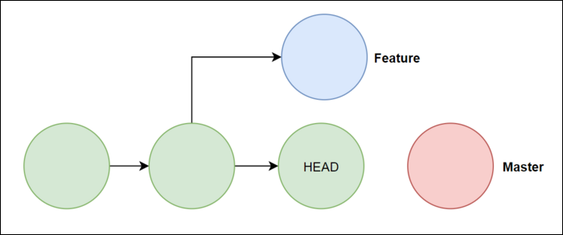

# Git reflog

`git reflog`는 로컬 저장소에서 HEAD의 업데이트를 기록을 출력한다. 업데이트의 내용은 저장소 디렉토리의 `.git/logs/refs/heads/.` 혹은 `.git/logs/HEAD`에 기록되며 git reflog는 이 내용을 출력한다.

# git reflog 명령어

모든 브랜치의 reflog를 보고 싶다면 아래와 같이 호출한다.

```bash
git reflog

// 위의 명령어는 아래의 명령어가 생략된 것이다.
git reflog show HEAD
```

특정 브랜치의 reflog만 보고 싶다면 아래와 같이 호출하면 된다.

```bash
$ git reflog [show] "branch name"
```

# git reflog가 알려주는 정보

- **commit id(Hash)**
  - `4053b90`은 HEAD가 가리키고 있는 커밋 아이디(해쉬)를 나타낸다.
- **HEAD가 가르키는 브랜치**
  - `(HEAD -> {branch name})`는 HEAD가 어떤 브랜치를 가리키고 있는 지를 나타낸다.
- **최신의 HEAD가 참조하는 포인터가, 변경된 작업으로 부터 몇번째 전의 작업인지**
  - `HEAD@{n}`은 가장 최근의 HEAD의 참조가 변경된 작업으로 부터 몇번째 전의 작업 인지를 알려줍니다. HEAD@{0}은 가장 최근에(방금)한 작업이고, HEAD@{2}는 가장 최근에 한 작업으로부터 2번째 전의 작업.
- **어떤 git 명령어를 통해 작업을 했는지**
  - `git commit`
  - `git checkout`
  - `git reset`
  - `git merge`
  - `git rebase`
  - `git cherrypick`
- **커밋 메시지**
- **.git/logs/HEAD 혹은 .git/logs/refs/heads/{branch name}**

  - `.git/logs/refs/heads/{branch name}`는 로컬 특정 브랜치의 HEAD 참조의 변경 기록을 나타낸다.
  - `.git/logs/HEAD`는 모든 로컬 브랜치의 HEAD 참조의 변경 기록을 나타낸다.

  # git reset 이란?

  git reflog를 통해 복원하는 방법을 배우기 전에 `git reset`의 원리에 대해 알아야 한다.
  또한, git reset을 알아보기 전에 위에서 계속 언급되었던 `HEAD`에 대해 정확히 알아야 한다.

  ### git HEAD

  `GIT`에서의 `HEAD`는 현재 checkout된 브랜치의 최신 커밋에 위치한다.
  하지만, 실제로는 커밋을 직접 가리키는 것이 아니라, 해당 브랜치를 가리키는 것이고, 자동으로 최신 커밋을 사용하는 것일 뿐이다.
  만약 HEAD의 위치가 최신 커밋의 위치(브랜치)가 아니라면 `detached HEAD` 상태가 된다.

  ### git reset의 동작원리

  `git reset`은 현재 작업 위치인 HEAD의 포인터를 특정 위치로 변경하는 것이다.
  각각의 커밋은 이전 커밋과 연결된다. `git reset`을 통해 HEAD의 위치를 변경해주면 HEAD보다 뒤에 있는 커밋들은 연결이 사라지게 되고 히스토리에서 삭제된 것 처럼 보이게 된다.

  

  이렇게 `git reset`으로 없어진 커밋은 삭제된 것이 아니라, `고아(orphans)` 상태가 된 것일 뿐이므로 `git reflog`를 통해서는 확인할 수 있다.
  `고아(orphans)` 상태란 해당 커밋에 직접적으로 접근할 수 있는 경로가 없어진 것이다. 이러한 커밋들은 `commit Id`만 알고 있다면 복원 가능하다.
  Git은 일반적으로 30일마다 `가비지 컬렉터`를 실행하여 이러한 고아 커밋을 영구적으로 삭제하므로, 삭제한지 얼마 지나지 않았고, `git reflog` 를 통해 지워진 커밋의 `commit Id`를 알게 된다면 `git reset --hard` 명령어를 통해 HEAD의 위치를 바꿔줌으로써 커밋을 복구할 수 있다.
  💡 git은 위험한 명령을 수행하기 전에 HEAD가 가리키고 있는 commit Id를 `.git/ORIG_HEAD`에 기록하므로, `git reset --hard ORIG_HEAD` 실행하면 방금 실행했던 명령을 취소 할 수 있다.

  ```jsx
  git reset --hard HEAD@{n}
  ```
